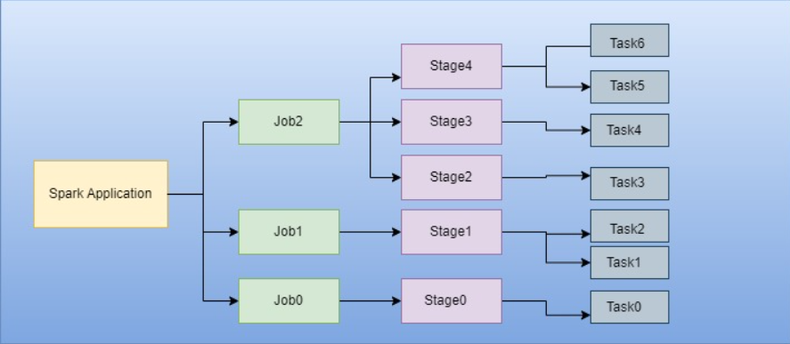
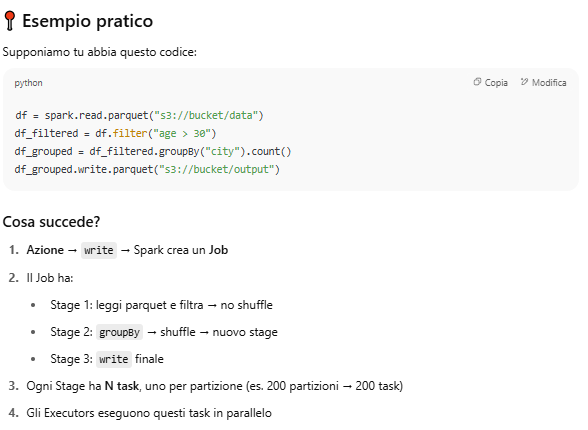

# Job / Stage / Task

### 1. **Driver Program**:

- Avvia la Spark Application.
- Traduce un'azione (es. `collect()`, `save()`) in uno o più **Job**.
- Coordina gli **executors** e pianifica i **task**.

---

### 2. **Job**:

- Un **Job** è creato ogni volta che viene invocata un'**azione** su una RDD/DataFrame.
- Esempio: `df.count()` o `df.write.parquet(...)` → genera un Job.

---

### 3. **Stage**:

- Ogni Job è suddiviso in **Stage**.
- Ogni Stage è una sequenza di operazioni che possono essere eseguite **senza shuffle**.
- Uno shuffle (ad es. `groupBy`, `join`) fa terminare uno stage e ne inizia uno nuovo.

---

### 4. **Task**:

- Ogni Stage è suddiviso in **Task**, uno per partizione.
- Ogni **executor** riceve uno o più **task** da eseguire.
- Un task è l’unità minima di lavoro (es. applicare una funzione su una partizione).

